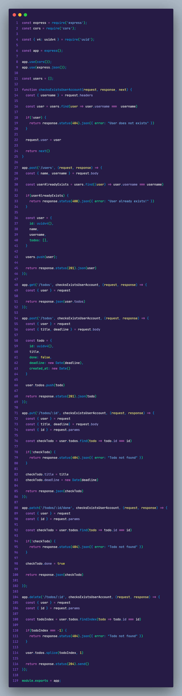
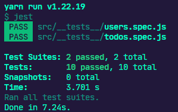

# Desafio 1 do Ignite Trilha NodeJS


<h3 align="center">
  Desafio 01: Conceitos do Node.js
</h3>

<p align="center">
  

  <a href="https://app.rocketseat.com.br/me/matheus-marins">
    
  </a>

 <a href="https://github.com/rocketseat-education/ignite-template-conceitos-do-nodejs/stargazers">
    
  </a>
</p>

---

# :rocket: Sobre o desafio

Nesse desafio, foi criada uma aplicação backend para treinar o que aprendi até agora no Node.js!

É uma aplicação para gerenciar tarefas (em inglês *todos*). Será permitida a criação de um usuário com `name` e `username`, bem como fazer o CRUD de *todos*:

- Criar um novo *todo*;
- Listar todos os *todos*;
- Alterar o `title` e `deadline` de um *todo* existente;
- Marcar um *todo* como feito;
- Excluir um *todo*;

Tudo isso para cada usuário em específico (o `username` será passado pelo header).

 ### **Para saber tudo sobre o desafio acesse [NotionDesafio](https://www.notion.so/Desafio-01-Conceitos-do-Node-js-59ccb235aecd43a6a06bf09a24e7ede8).**
 
---
### :keyboard: Instalação e Execução do Projeto

- Clone este repositório

```
> git clone https://github.com/Mar0la/ignite-conceitos-nodejs
```

- Navegue até o diretório principal do projeto

```
> cd ignite-conceitos-nodejs
```

- Instale as dependências com o Yarn

```
yarn
```

- Rode a suite de testes

```
yarn test
```

- Execute o projeto

```
yarn dev
```
---
### **Resolução do Desafio**
  


### **Retorno que devemos ter ao digitar  <code>yarn test</code>** no terminal
  

---
## FeedBack do Desafio
  - Como só tem que completar algumas partes, achei bem simples, não que isso seja uma coisa  ruim até porque se achei simples foi porque  entendi o que foi abordado ate agora no Ignite, além do que esse é o primeiro de muitos desafios.
---


